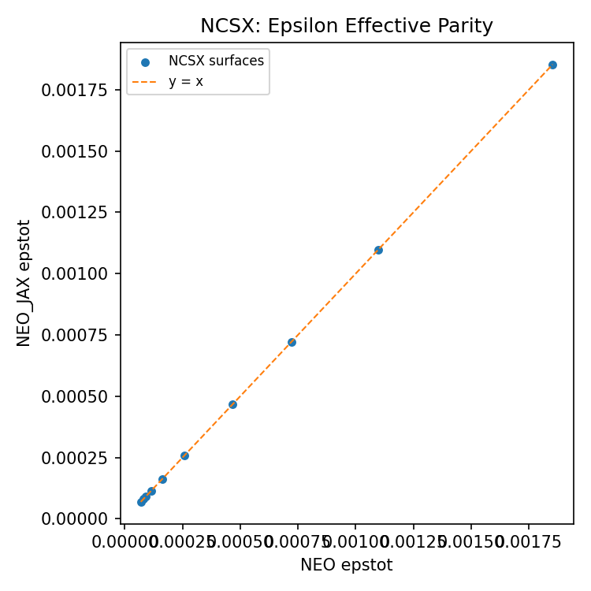

# NEO_JAX

JAX port of the STELLOPT NEO code for computing effective helical ripple and
related neoclassical transport diagnostics, with an end-to-end differentiable
pipeline through VMEC and Boozer transforms.

## Quick start

```bash
pip install -e .
```

```bash
neo-jax ORBITS --boozmn tests/fixtures/orbits/boozmn_ORBITS.nc --verbose
```

The package also installs legacy-compatible entrypoints:

```bash
xneo
xneo_jax
python -m neo_jax
```

If you prefer not to install, run from the repo root with:

```bash
PYTHONPATH=. python examples/ncsx_epsilon_effective_plot.py
```

## Legacy `xneo` Compatibility

`neo_jax` now supports the same terminal workflow as STELLOPT's `xneo`,
including both the effective-ripple solve (`calc_cur = 0`) and the
parallel-current path (`calc_cur = 1`). The intent is simple: if you already
have a working legacy NEO case, you should be able to point the same control
file at `neo_jax` and keep the same filenames, CLI invocation, and output-file
layout.

Legacy invocation:

```bash
xneo ORBITS
xneo_jax ORBITS
python -m neo_jax ORBITS
```

Unlike the STELLOPT binary, `neo_jax` prints explicit progress messages by
default so a long parity run does not look stalled. Use `--quiet` if you want
the legacy file outputs without the extra terminal logging.

Control-file lookup follows the same search order as STELLOPT:

1. `neo_param.<extension>`
2. `neo_param.in`
3. `neo_in.<extension>`
4. if no extension is given: `neo.in`

For `inp_swi = 0`, the CLI follows the legacy `boozmn_<extension>.nc`
convention used by STELLOPT. For nonzero `inp_swi`, it resolves the input from
`IN_FILE` in the control file.

What the legacy CLI writes:

- main output: `neo_out.*`
- log file: `neolog.*`
- parallel-current summary when `calc_cur = 1`: `neo_cur.*`
- optional parallel-current integration history: `current.dat`
- optional diagnostic files: `diagnostic.dat`, `diagnostic_add.dat`,
  `diagnostic_bigint.dat`
- optional integration history: `conver.dat`
- optional geometry dumps: `dimension.dat`, `theta_arr.dat`, `phi_arr.dat`,
  `rmnc_arr.dat`, `bmnc_arr.dat`, `b_s_arr.dat`, and the other legacy array
  files controlled by `WRITE_OUTPUT_FILES`

Compatibility scope:

- supported: `calc_cur = 0` and `calc_cur = 1`
- control-file lookup parity for `neo_param.<ext>`, `neo_param.in`,
  and `neo_in.<ext>`
- legacy Boozer filename resolution via `boozmn_<extension>.nc`
- default CLI progress logging, with `--quiet` available for benchmarking or
  silent batch runs

How the compatibility layer is implemented:

- `neo_jax/cli.py` mirrors the legacy command-line contract and control-file
  search logic.
- `neo_jax/legacy.py` reproduces the Fortran text formatting used in
  `neo_out.*`, `neo_cur.*`, `neolog.*`, `diagnostic*.dat`, `current.dat`, and
  `conver.dat`.
- `neo_jax/driver.py` writes the same auxiliary files that STELLOPT writes when
  `WRITE_OUTPUT_FILES`, `WRITE_INTEGRATE`, `WRITE_DIAGNOSTIC`, or
  `WRITE_CUR_INTE` are enabled.
- `NEO_JAX_WRITE_IPMAX_DEBUG=1` writes `diagnostic_ipmax_jax.dat`, a per-step
  dump of the trapped-event amplitude used while building `conver.dat`.
- `neo_jax/current.py` ports the legacy `flint_cur` / `calccur` path to JAX so
  `neo_cur.*` and `current.dat` are produced by the same CLI entrypoint.
- The solver still calls the same JAX/Python backend used by the public API, so
  the terminal interface and Python interface stay numerically aligned.

How it is tested:

- `tests/regression/test_cli_legacy.py` runs the real reference executable from
  `~/bin/xneo` (or `NEO_REFERENCE_BIN`) and compares its outputs against the
  JAX CLI.
- The test suite covers:
  - a real dense fixture: `LandremanPaul2021_QA_lowres`
  - a synthetic one-surface ORBITS legacy case that exercises `neo_out`,
    `neolog`, `diagnostic*.dat`, `conver.dat`, and all legacy array dumps
  - a one-surface ORBITS `calc_cur = 1` case that checks `neo_cur.*` exactly
    and `current.dat` token-by-token against the STELLOPT executable
  - control-file precedence checks for `neo_param.<extension>` and
    `neo_param.in`
  - optional slow full-fixture parity checks for `ORBITS_FAST` and
    `ncsx_c09r00_free_fast` when `NEO_JAX_RUN_SLOW=1`

Current comparison status:

- `neo_out.*`, `neo_cur.*`, `diagnostic*.dat`, and `neolog.*` match the
  reference text output exactly on the legacy parity cases.
- `conver.dat` matches exactly on the synthetic ORBITS parity case. On the full
  `ORBITS_FAST` fixture, columns 1-4 match exactly; the fifth column is traced
  with `diagnostic_ipmax_jax.dat` because the STELLOPT binary's text output on
  that dense case does not follow its own traced `aditot / p_bm2` state.
- `current.dat` matches token-by-token, including `NaN`/`Infinity` placement,
  with tight floating-point tolerances to account for backend-level roundoff in
  the intermediate current history.
- The legacy array dumps (`*_arr.dat`, `dimension.dat`, `theta_arr.dat`,
  `phi_arr.dat`) are numerically identical to within floating-point roundoff.

## Simple Python API

```python
from neo_jax import NeoConfig, run_neo

# Surfaces may be specified by index or by s in [0, 1].
config = NeoConfig(surfaces=[0.15, 0.35, 0.6, 0.85], theta_n=64, phi_n=64)
results = run_neo("boozmn.nc", config=config)

# Access by name
print(results.epsilon_effective)
print(results["epsilon_effective_by_class"].shape)
```

## JAX-native pipeline

You can run directly on JAX-native Boozer outputs (for example from
`booz_xform_jax.jax_api`) without writing `boozmn` files:

```python
from neo_jax import NeoConfig, run_neo

# booz_out is a dict with keys like rmnc_b, zmns_b, pmns_b, bmnc_b, ixm_b, ixn_b
results = run_neo(booz_out, config=NeoConfig(surfaces=[1, 2, 3]))
```

For a full vmec_jax → booz_xform_jax → neo_jax workflow (no file I/O), use:

```python
from neo_jax import NeoConfig, run_vmec_boozer_neo

config = NeoConfig(surfaces=[0.25, 0.5, 0.75], theta_n=32, phi_n=32)
results = run_vmec_boozer_neo(
    "path/to/input.vmec",
    vmec_kwargs=dict(max_iter=1, use_initial_guess=True, vmec_project=False),
    booz_kwargs=dict(mboz=8, nboz=8),
    neo_config=config,
)
```

For a JAX-native VMEC→Boozer adapter plus a JAX surface scan, use
`run_vmec_boozer_neo_jax` on a `vmec_jax.FixedBoundaryRun` object.

When using JAX surface scans, the return type is a JAX-friendly
`NeoOutputs`. Convert it to the standard `NeoResults` container with:

```python
from neo_jax import neo_outputs_to_results

results = neo_outputs_to_results(outputs)
```

If you want a reusable, JIT-friendly pipeline callable (useful for loops and
optimizers), use `build_vmec_boozer_neo_jax`:

```python
from neo_jax import build_vmec_boozer_neo_jax, NeoConfig

solver = build_vmec_boozer_neo_jax(run, booz_kwargs=dict(mboz=8, nboz=8),
                                   neo_config=NeoConfig(surfaces=[0.5]), jit=True)
outputs = solver(run.state)
```

## Documentation

Sphinx documentation lives in `docs/` and is configured for Read the Docs.
See `docs/index.rst` for the table of contents.


## Examples

- `examples/ncsx_epsilon_effective_plot.py`: compute and plot epsilon effective vs `s`.
- `examples/ncsx_autodiff_Rmajor_optimization.py`: autodiff optimization demo over `Rmajor`.
- `examples/epsilon_effective_scale_optimization.py`: toy autodiff example that scales |B| to reduce epsilon effective.
- `examples/qh_epsilon_effective_aspect_optimization.py`: QH warm-start optimization (epsilon effective + aspect ratio).
- `examples/vmec_boozer_neo_pipeline.py`: full vmec_jax → booz_xform_jax → neo_jax pipeline.

## NCSX Parity Snapshot



## Legacy CLI Benchmark Snapshot

Measured on this workstation with ``/usr/bin/time -l`` using the STELLOPT
reference binary ``~/bin/xneo`` and ``python -m neo_jax --quiet`` so the table
reflects solver cost rather than terminal logging overhead.

| Case | Parity status | `xneo` runtime (s) | `neo_jax` runtime (s) | Runtime ratio | `xneo` max RSS (MiB) | `neo_jax` max RSS (MiB) | Memory ratio |
| --- | --- | ---: | ---: | ---: | ---: | ---: | ---: |
| `LandremanPaul2021_QA_lowres` | Pass | 2.24 | 16.15 | 7.21x | 25.0 | 1471.8 | 58.83x |
| `ORBITS_MINI` | Pass | 0.05 | 18.66 | 373.20x | 14.6 | 1285.9 | 87.83x |
| `ORBITS_CURINT` | Pass | 0.33 | 6.67 | 20.21x | 14.6 | 624.4 | 42.70x |
| `ORBITS_FAST` | Pass (`neo_out` / `neolog` / `conver[:4]`) | 0.10 | 8.61 | 86.10x | 15.0 | 756.6 | 50.33x |
| `NCSX_MINI` | Pass | 0.06 | 5.62 | 93.67x | 35.0 | 581.8 | 16.64x |
| `ncsx_c09r00_free_fast` | Pass at `rtol≈5e-3` | 2.30 | 12.96 | 5.63x | 38.0 | 1307.3 | 34.43x |

Notes:

- ``ncsx_c09r00_free_fast`` now passes the slow CLI regression at about
  ``rtol=5e-3`` (implemented as ``5.1e-3`` to account for the rounded legacy
  text output).
  The current last-surface ``epstot`` values are
  ``0.7159689869E-03`` (`xneo`) vs ``0.7123614767E-03`` (`neo_jax`).
- ``ORBITS_FAST`` is now practical again in legacy mode because ``WRITE_INTEGRATE=1``
  uses the JAX solver plus a convergence callback instead of forcing the full
  Python-loop backend.
- The dense ``ORBITS_FAST`` regression now checks ``conver.dat`` columns 1-4 in
  CI and exposes ``NEO_JAX_WRITE_IPMAX_DEBUG=1`` for step-by-step parity
  debugging of the remaining fifth-column discrepancy.

| Metric | NEO (Fortran) | NEO_JAX (JAX) | Notes |
| --- | --- | --- | --- |
| Epsilon effective parity (max rel error, epstot) | — | 2.5e-10 | vs `tests/fixtures/ncsx/neo_out.ncsx_c09r00_free` |
| Runtime (10 surfaces, NCSX) | 60.37 s | 51.37 s | JAX time is steady-state after warmup |
| Max RSS (NCSX run) | 72.8 MiB | 4.45 GB | Measured via `/usr/bin/time -l` |

Repro commands:

```bash
# Fortran runtime + memory
/usr/bin/time -l /Users/rogerio/local/STELLOPT/NEO/Release/xneo ncsx_c09r00_free

# JAX runtime (steady-state) + memory
/usr/bin/time -l env PYTHONPATH=/Users/rogerio/local/tests/NEO_JAX \
  python /Users/rogerio/local/tests/NEO_JAX/benchmarks/benchmark_ncsx.py --jax --warmup
```


## Performance Tuning

NEO_JAX supports two Fourier evaluation modes:

- `NEO_JAX_FOURIER_MODE=vectorized` (default): fastest but allocates theta×phi×mode temporaries.
- `NEO_JAX_FOURIER_MODE=streamed`: lower memory by streaming over modes; slightly slower.

NCSX benchmark comparison (10 surfaces, CPU warmup run, `/usr/bin/time -l`):

| Mode | Total time | Max RSS |
| --- | --- | --- |
| Vectorized | 51.37 s | 4.45 GB |
| Streamed | 58.78 s | 2.55 GB |

## Precision

NEO_JAX enables 64-bit JAX precision by default to match the Fortran
reference outputs. You can override this behavior by setting either:

- `NEO_JAX_ENABLE_X64=0` (NEO_JAX-specific)
- `JAX_ENABLE_X64=0` (global JAX)

## Status

This repository is under active development. See `PLAN.md` for the porting
plan and roadmap.

## Validation Cases

Current parity fixtures include:

- ORBITS (fast + full)
- NCSX tutorial case (fast by default; full gated by `NEO_JAX_RUN_SLOW=1`)
- LandremanPaul2021_QA_lowres (dense, 64x64 grid)
