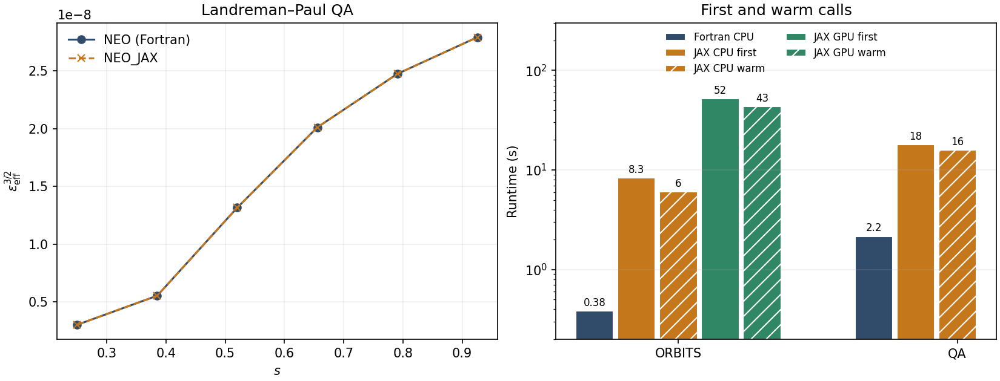

# NEO_JAX

[](https://pypi.org/project/neo-jax/)
[](https://github.com/uwplasma/NEO_JAX/actions/workflows/ci.yml)
[](https://pypi.org/project/neo-jax/)
[](LICENSE)

Effective helical ripple and trapped-particle diagnostics from Boozer geometry, with CPU/GPU kernels, automatic differentiation and a legacy NEO command line.

## Installation

```bash
pip install neo-jax
```

The VMEX → Boozer → NEO pipeline requires Python 3.11+, VMEX 0.11.6+ and booz_xform_jax 0.4.3+:

```bash
pip install "neo-jax[pipeline]"
```

For NVIDIA GPUs, install [JAX with CUDA support](https://docs.jax.dev/en/latest/installation.html#nvidia-gpu) in the same environment. For development, use `pip install -e .[dev,docs]` in a clone.

## Quick start

Use an existing `neo_in.mycase` control file and `boozmn_mycase.nc`:

```bash
neo-jax mycase --quiet
```

`xneo`, `xneo_jax` and `python -m neo_jax` provide the same interface. The [CLI guide](docs/cli.rst) covers control-file lookup, progress reporting and legacy output files.

```python
from neo_jax import NeoConfig, run_neo

config = NeoConfig(surfaces=[0.25, 0.5, 0.75], theta_n=64, phi_n=64)
results = run_neo("boozmn_mycase.nc", config=config)
print(results.epsilon_effective)  # epsilon_eff^(3/2), the legacy epstot quantity
```

## Capabilities

| Feature | NEO (Fortran) | NEO_JAX |
|---|:---:|:---:|
| CPU | ✅ | ✅ |
| GPU | ❌ | ✅ |
| Automatic differentiation | ❌ | ✅ |
| Effective ripple and parallel current | ✅ | ✅ |
| Legacy control and output files | ✅ | ✅ |
| Stellarator symmetric geometry | ✅ | ✅ |
| Validated nonstellarator symmetric pipeline | ❌ | ❌ |
| VMEX → Boozer → NEO without intermediate files | ❌ | ✅ |

Asymmetric WOUT and `boozmn` inputs are rejected. Float64 is enabled by default; low-`|iota|` surfaces have an explicit [work guard](docs/configuration.rst), with exact and approximate policies.

## Accuracy and speed

Matched STELLOPT calculations agree in effective ripple across ORBITS and QA surfaces. The [validation guide](docs/validation.rst) also covers NCSX, geometry, parallel current, CPU/GPU parity and legacy diagnostics.



| Case | Surfaces | Maximum relative ripple error | Fortran CPU | JAX CPU first / warm | JAX GPU first / warm |
|---|---:|---:|---:|---:|---:|
| ORBITS | 2 | 1.5e-10 | 0.382 s | 8.31 / 6.02 s | 52.28 / 43.40 s |
| Landreman–Paul QA | 6 | 1.7e-10 | 2.16 s | 18.09 / 15.84 s | — |

Apple M2 CPU with JAX 0.10.2; RTX A4000 GPU with JAX 0.9.2; float64 and compilation cache disabled. Fortran includes process startup; JAX includes Boozer file reads and compilation, with imports excluded. ORBITS requests convergence history. Fortran is faster on these cases; [measurements](benchmarks/comparison.json) record controls, ripple profiles and timing scopes.

Reproduce one case with a STELLOPT executable:

```bash
python benchmarks/benchmark_orbits.py --jax --warmup \
  --control tests/fixtures/orbits/neo_in.ORBITS_FAST \
  --boozmn tests/fixtures/orbits/boozmn_ORBITS_FAST.nc \
  --reference-bin xneo --output comparison.json
```

## Differentiable pipeline

Pass a VMEX input to the host pipeline, or a solved `vmex.optimize.Equilibrium` to the [JAX pipeline](docs/vmec_boozer.rst) for derivatives:

```python
from neo_jax import NeoConfig, run_vmec_boozer_neo

results = run_vmec_boozer_neo(
    "input.mycase", booz_kwargs=dict(mboz=8, nboz=8),
    neo_config=NeoConfig(surfaces=[0.25, 0.5, 0.75], theta_n=32, phi_n=32),
)
```

[Examples](docs/applications.rst) cover ripple profiles, geometry derivatives and optimization. The large NCSX fixture is fetched on demand with `neo_jax.ncsx_boozmn_path(download=True)`.

## Documentation and citation

[Quickstart](docs/quickstart.rst) · [Theory](docs/theory.rst) · [Configuration](docs/configuration.rst) · [Numerics](docs/numerics.rst) · [Differentiability](docs/differentiability.rst) · [API](docs/api.rst) · [References](docs/references.rst)

Cite the NEO literature in [the bibliography](docs/references.rst), together with this repository. Licensed under [MIT](LICENSE).
