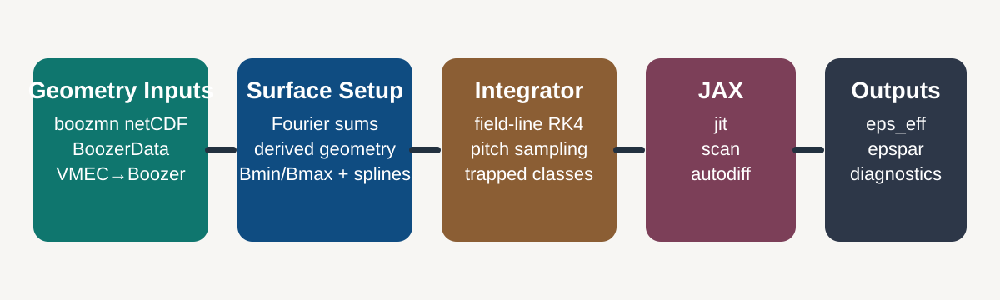

NEO_JAX
=======

.. rst-class:: hero-title

NEO_JAX is a standalone neoclassical transport code for stellarators.

.. rst-class:: hero-lead

It computes effective ripple and related trapped-particle diagnostics from
Boozer-coordinate geometry, provides a clean Python API, integrates directly
with :doc:`vmec_boozer`, and uses JAX for just-in-time compilation, vectorized
surface evaluation, and automatic differentiation.

.. button-link:: installation
   :color: primary
   :shadow:

   Installation

.. button-link:: quickstart
   :color: secondary
   :shadow:

   Quickstart

.. button-link:: user_api
   :color: secondary
   :shadow:

   Python API

.. button-link:: applications
   :color: secondary
   :shadow:

   Applications

What The Documentation Covers
-----------------------------

.. grid:: 1 1 2 2
   :gutter: 3

   .. grid-item-card:: Physics model
      :link: theory
      :link-type: doc

      Governing equations for :math:`\epsilon_{\mathrm{eff}}^{3/2}`,
      trapped-particle classes, field-line integrals, and reference scalings.

   .. grid-item-card:: Numerics and algorithms
      :link: numerics
      :link-type: doc

      Fourier reconstruction, spline interpolation, Newton refinement,
      RK4 integration, rational-surface handling, and workload controls.

   .. grid-item-card:: Geometry and pipelines
      :link: vmec_boozer
      :link-type: doc

      ``boozmn`` inputs, in-memory Boozer objects, VMEC→Boozer→NEO pipelines,
      and the exact data model consumed by the solver.

   .. grid-item-card:: JAX and differentiation
      :link: differentiability
      :link-type: doc

      What stays on device, which paths are JIT-friendly, and how NEO_JAX is
      used in optimization and design studies.

   .. grid-item-card:: Inputs, knobs, and outputs
      :link: configuration
      :link-type: doc

      ``NeoConfig``, control-file fields, runtime environment variables, CLI
      switches, diagnostics, and result containers.

   .. grid-item-card:: Validation and testing
      :link: testing
      :link-type: doc

      Regression structure, CI coverage, performance guardrails, and
      comparisons against established reference cases where appropriate.

.. toctree::
   :maxdepth: 2
   :hidden:

   overview
   installation
   quickstart
   applications
   user_api
   configuration
   cli
   vmec_boozer
   theory
   numerics
   differentiability
   source_guide
   fortran_map
   tutorials_orbits
   tutorials_ncsx
   validation
   testing
   performance
   api
   references
